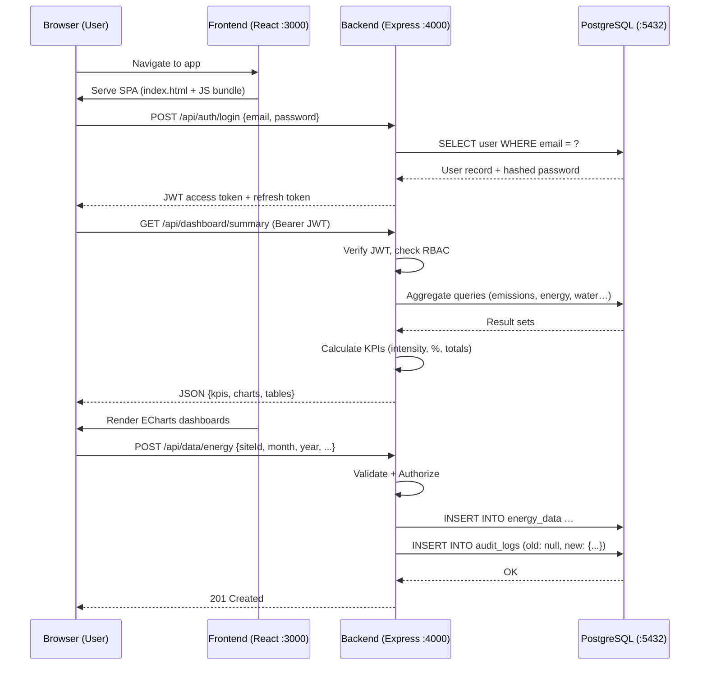
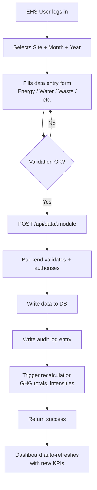

# ESG & Environmental Data Management Platform — High-Level Design (HLD)

**Version:** 1.1  
**Date:** 2026-02-24  
**Status:** Draft (Rev 1 — addressed review feedback)  

---

## 1. Executive Summary

This document describes the high-level architecture of an **ESG & Environmental Data Management Web Application**. The platform enables an EHS (Environment, Health & Safety) team to capture monthly sustainability data across six manufacturing sites and provides management with real-time dashboards aligned to global ESG reporting frameworks (EcoVadis, CDP, GRI, BRSR, GHG Protocol).

The system is deployed as a **Docker-based, single-server intranet application** running on a WSL (Windows Subsystem for Linux) environment.

---

## 2. What Is "Intranet" in This Context?

### 2.1 Definition

An **intranet** is a private network accessible only within an organisation's internal network boundary. Unlike public internet-hosted applications, an intranet application:

| Aspect | Internet Application | Intranet Application (Ours) |
|---|---|---|
| **Accessibility** | Reachable from anywhere on the public internet | Reachable only from machines on the same local network (LAN/VPN) |
| **DNS / Domain** | Requires a public domain name and DNS records | Accessed via the host machine's LAN IP address (e.g. `http://192.168.1.50:3000`) |
| **TLS / HTTPS** | Mandatory (public CA certificates) | Optional; self-signed certificate or plain HTTP acceptable |
| **Authentication** | OAuth / SSO with external IdP | JWT-based local auth is sufficient |
| **Hosting** | Cloud VMs, managed services | Single physical/virtual machine on premises |

### 2.2 Our Intranet Setup

```
┌─────────────────────────────────────────────┐
│              Corporate LAN / Wi-Fi          │
│                                             │
│   ┌─────────┐  ┌─────────┐  ┌─────────┐    │
│   │ Browser │  │ Browser │  │ Browser │    │
│   │ (User A)│  │ (User B)│  │ (Viewer)│    │
│   └────┬────┘  └────┬────┘  └────┬────┘    │
│        │             │            │         │
│        └─────────────┼────────────┘         │
│                      │                      │
│          http://<WSL-IP>:3000               │
│                      │                      │
│   ┌──────────────────▼──────────────────┐   │
│   │        WSL Host Machine             │   │
│   │   ┌──────────────────────────────┐  │   │
│   │   │     Docker Compose Stack     │  │   │
│   │   │  ┌────────┐ ┌────────┐       │  │   │
│   │   │  │Frontend│ │Backend │       │  │   │
│   │   │  │ :3000  │ │ :4000  │       │  │   │
│   │   │  └────────┘ └───┬────┘       │  │   │
│   │   │                 │            │  │   │
│   │   │          ┌──────▼──────┐     │  │   │
│   │   │          │ PostgreSQL  │     │  │   │
│   │   │          │   :5432     │     │  │   │
│   │   │          └─────────────┘     │  │   │
│   │   └──────────────────────────────┘  │   │
│   └─────────────────────────────────────┘   │
└─────────────────────────────────────────────┘
```

- **No public DNS required** — users access the app via the host's LAN IP.
- **No cloud infrastructure** — everything runs on a single WSL machine.
- **Single-command startup** — `docker compose up` brings up the entire stack.

---

## 3. Technology Stack Decisions

| Layer | Technology | Rationale |
|---|---|---|
| **Frontend** | React 18 + TypeScript | Type safety, component ecosystem, as specified in requirements |
| **Styling** | Tailwind CSS | Rapid utility-first styling, as specified |
| **Charts** | Apache ECharts (via `echarts-for-react`) | Rich chart types (gauge, heatmap, radar), better for dashboards than Recharts |
| **Backend** | Node.js 20 LTS + Express.js | Lightweight, same language as frontend, large middleware ecosystem |
| **Language** | TypeScript (backend too) | End-to-end type safety, shared DTOs |
| **Auth** | JWT (jsonwebtoken) | Stateless, simple for intranet, no external IdP needed |
| **Database** | PostgreSQL 16 | ACID, JSON support, mature, as specified |
| **ORM** | Prisma | Type-safe queries, migration management, schema-first |
| **Web Server** | Nginx (Alpine) | Static file serving, reverse proxy, SPA routing — see §3.1 |
| **Export — Excel** | ExcelJS | `.xlsx` generation with formatting |
| **Export — PDF** | Puppeteer (headless) or PDFKit | Board-ready PDF reports with embedded charts |
| **Containerisation** | Docker + Docker Compose | Single-command deployment, environment parity |
| **Process Manager** | Docker (restart policies) | Auto-restart on failure |
| **Logging** | Winston + Morgan | Structured JSON logs, HTTP request logging — see §9 |
| **Testing** | Vitest (FE) + Jest + Supertest (BE) | Fast unit/integration tests — see §10 |
| **API Specification** | OpenAPI 3.0 (Swagger) | Machine-readable API contracts — see LLD §2 |

### 3.1 Why Nginx?

**Nginx** is a high-performance, open-source web server and reverse proxy. In our architecture it serves three critical roles:

| Role | What it does | Why not skip it? |
|---|---|---|
| **Static file server** | Serves the production-built React SPA (HTML, JS, CSS, images) from `/usr/share/nginx/html` | Vite's dev server is not meant for production use — it is slow and memory-heavy. Nginx serves static files at near-zero CPU cost. |
| **Reverse proxy** | Forwards any request path starting with `/api/` to the backend container (`http://backend:4000`) | Without this, the browser would need to know the backend's port, breaking the single-origin model and requiring CORS headers. Nginx gives the user a single URL (`http://<IP>:3000`) for everything. |
| **SPA fallback routing** | `try_files $uri $uri/ /index.html` ensures that deep-linked React routes (e.g. `/data-entry`, `/admin`) return `index.html` instead of a 404 | Without this, refreshing a page on any route other than `/` would break. |

**Why Nginx over alternatives (Apache, Caddy)?**
- **Minimal footprint:** `nginx:alpine` Docker image is ~7 MB — ideal for our single-server WSL deployment.
- **Battle-tested reverse proxy:** Used by >30% of all web servers globally; configuration is simple and well-documented.
- **Zero runtime dependencies:** No separate process or language runtime needed.

### 3.2 Why Prisma?

**Prisma** is a next-generation Node.js/TypeScript ORM (Object-Relational Mapper) that replaces hand-written SQL with a type-safe query API auto-generated from your database schema.

**How it works:**
1. You define your database schema in a `schema.prisma` file (declarative DSL).
2. Prisma generates a **type-safe TypeScript client** (`@prisma/client`) — every table becomes a typed object with autocomplete for columns, relations, and filters.
3. Prisma manages **database migrations** — schema changes are versioned as SQL migration files.

**Why Prisma over raw SQL or other ORMs (Sequelize, TypeORM)?**

| Criterion | Prisma | Raw SQL / pg driver | Sequelize / TypeORM |
|---|---|---|---|
| **Type safety** | ✅ Auto-generated TS types from schema | ❌ Manual type definitions | ⚠️ Partial, decorator-heavy |
| **Migration management** | ✅ Built-in `prisma migrate` | ❌ Manual or separate tool | ⚠️ Varies in reliability |
| **Query correctness** | ✅ Compile-time errors for wrong column names | ❌ Runtime errors only | ⚠️ Runtime errors for most issues |
| **Learning curve** | Low (schema-first, intuitive API) | Low but error-prone | Medium-high |
| **SQL injection risk** | ✅ Parameterised by default | ⚠️ Easy to forget | ✅ Parameterised |

**Justification for this project:** Since both frontend and backend use TypeScript, Prisma gives us end-to-end type safety — from database columns to API responses to React components — eliminating an entire class of bugs where a column name is misspelt or a type is wrong.

---

## 4. System Architecture

### 4.1 Architecture Style

**Monolithic Modular** — a single backend service with clearly separated internal modules (domains). This is the right choice for a POC / single-server intranet app because:

- Zero network overhead between modules
- Simple deployment (one container)
- Easy to refactor to microservices later if needed

### 4.2 Logical Architecture

```
┌──────────────────────────────────────────────────────┐
│                    PRESENTATION LAYER                 │
│                                                      │
│  React SPA (TypeScript + Tailwind + ECharts)         │
│  ┌────────────┐ ┌───────────┐ ┌──────────────────┐   │
│  │ Auth Pages │ │ Data Entry│ │ Dashboard Views  │   │
│  │ Login      │ │ Forms     │ │ Charts / KPIs    │   │
│  └────────────┘ └───────────┘ └──────────────────┘   │
│  ┌────────────┐ ┌───────────┐ ┌──────────────────┐   │
│  │ Admin      │ │ Reports   │ │ Data Import      │   │
│  │ Panel      │ │ Export    │ │ (Excel Upload)   │   │
│  └────────────┘ └───────────┘ └──────────────────┘   │
└───────────────────────┬──────────────────────────────┘
                        │  REST API (JSON over HTTP)
                        ▼
┌──────────────────────────────────────────────────────┐
│                    APPLICATION LAYER                  │
│                 (Node.js + Express + TS)              │
│                                                      │
│  ┌─────────────────────────────────────────────────┐  │
│  │                  Middleware                      │  │
│  │  Auth (JWT) │ RBAC │ Validation │ Error Handler │  │
│  └─────────────────────────────────────────────────┘  │
│                                                      │
│  ┌──────────┐ ┌──────────┐ ┌──────────┐ ┌────────┐  │
│  │ Auth     │ │ Data     │ │ Dashboard│ │ Export │  │
│  │ Module   │ │ Entry    │ │ & Calc   │ │ Module │  │
│  │          │ │ Module   │ │ Engine   │ │        │  │
│  └──────────┘ └──────────┘ └──────────┘ └────────┘  │
│  ┌──────────┐ ┌──────────┐ ┌──────────┐             │
│  │ Admin    │ │ Import   │ │ Audit    │             │
│  │ Module   │ │ Module   │ │ Logger   │             │
│  └──────────┘ └──────────┘ └──────────┘             │
└───────────────────────┬──────────────────────────────┘
                        │  Prisma ORM
                        ▼
┌──────────────────────────────────────────────────────┐
│                     DATA LAYER                       │
│                   PostgreSQL 16                      │
│                                                      │
│  Core Tables: users, roles, sites, audit_logs        │
│  Data Tables: production, energy, water, waste,      │
│               emissions, air_quality, etp, recovery  │
│  Reference:   units, emission_factors, gwp,          │
│               conversion_factors, targets            │
└──────────────────────────────────────────────────────┘
```

### 4.3 Interaction Flow



---

## 5. Docker-Based Deployment Architecture

### 5.1 Container Topology

| Container | Image | Port | Volume |
|---|---|---|---|
| `esg-frontend` | Custom (Node build → Nginx serve) | `3000:80` | — |
| `esg-backend` | Custom (Node.js runtime) | `4000:4000` | `./uploads:/app/uploads` |
| `esg-db` | `postgres:16-alpine` | `5432:5432` | `pgdata:/var/lib/postgresql/data` |

### 5.2 Docker Compose Overview

```yaml
# docker-compose.yml (conceptual — actual file in LLD)
version: "3.9"

services:
  db:
    image: postgres:16-alpine
    environment:
      POSTGRES_DB: esg_platform
      POSTGRES_USER: esg_admin
      POSTGRES_PASSWORD: ${DB_PASSWORD}
    volumes:
      - pgdata:/var/lib/postgresql/data
      - ./backend/prisma/seed.sql:/docker-entrypoint-initdb.d/seed.sql
    ports:
      - "5432:5432"

  backend:
    build: ./backend
    depends_on:
      - db
    environment:
      DATABASE_URL: postgresql://esg_admin:${DB_PASSWORD}@db:5432/esg_platform
      JWT_SECRET: ${JWT_SECRET}
    ports:
      - "4000:4000"
    volumes:
      - ./uploads:/app/uploads

  frontend:
    build: ./frontend
    depends_on:
      - backend
    ports:
      - "3000:80"

volumes:
  pgdata:
```

### 5.3 Single-Command Startup

```bash
# From project root on the WSL machine:
docker compose up --build -d

# Verify:
docker compose ps
# → All three containers should show "running"

# Access:
# http://localhost:3000       (from the WSL host)
# http://<LAN-IP>:3000       (from other machines on the network)
```

---

## 6. Code Structure

### 6.1 Top-Level Repository Layout

```
ESGWebApp/
├── Docs/
│   ├── Problem Statement
│   └── Design Docs/
│       ├── HLD.md              ← this document
│       └── LLD.md
├── docker-compose.yml
├── .env.example
├── frontend/                   ← React application
│   ├── Dockerfile
│   └── ...
├── backend/                    ← Express API server
│   ├── Dockerfile
│   └── ...
└── README.md
```

### 6.2 Frontend Code Structure

```
frontend/
├── Dockerfile
├── nginx.conf                  # Serves built SPA, proxies /api → backend
├── package.json
├── tsconfig.json
├── tailwind.config.js
├── vite.config.ts              # Vite bundler config
├── public/
│   └── favicon.ico
└── src/
    ├── main.tsx                # React entry point
    ├── App.tsx                 # Root component, router setup
    ├── index.css               # Tailwind directives
    │
    ├── api/                    # API client layer
    │   ├── client.ts           # Axios instance with JWT interceptor
    │   ├── auth.ts             # login(), logout(), refreshToken()
    │   ├── dataEntry.ts        # CRUD for each data module
    │   ├── dashboard.ts        # Dashboard aggregation endpoints
    │   └── admin.ts            # User/site management
    │
    ├── auth/                   # Auth context & guards
    │   ├── AuthContext.tsx
    │   ├── AuthProvider.tsx
    │   └── ProtectedRoute.tsx
    │
    ├── components/             # Shared/reusable components
    │   ├── layout/
    │   │   ├── Sidebar.tsx
    │   │   ├── TopBar.tsx
    │   │   └── MainLayout.tsx
    │   ├── charts/
    │   │   ├── KPICard.tsx
    │   │   ├── TrendLineChart.tsx
    │   │   ├── ScopeBreakdownPie.tsx
    │   │   ├── SiteComparisonBar.tsx
    │   │   ├── IntensityChart.tsx
    │   │   ├── RenewableGauge.tsx
    │   │   └── RecoveryChart.tsx
    │   ├── forms/
    │   │   ├── DataEntryForm.tsx
    │   │   ├── BulkUpload.tsx
    │   │   └── FormField.tsx
    │   └── common/
    │       ├── Table.tsx
    │       ├── Modal.tsx
    │       ├── Filters.tsx
    │       └── ExportButton.tsx
    │
    ├── pages/                  # Route-level page components
    │   ├── LoginPage.tsx
    │   ├── DashboardPage.tsx
    │   ├── DataEntryPage.tsx
    │   ├── ReportsPage.tsx
    │   ├── ImportPage.tsx
    │   ├── AdminPage.tsx
    │   └── AuditLogPage.tsx
    │
    ├── hooks/                  # Custom React hooks
    │   ├── useAuth.ts
    │   ├── useDashboardData.ts
    │   └── useDataEntry.ts
    │
    ├── types/                  # TypeScript type definitions
    │   ├── models.ts           # User, Site, EnergyData, etc.
    │   ├── api.ts              # Request/Response DTOs
    │   └── enums.ts            # Roles, Scopes, WasteTypes, etc.
    │
    └── utils/
        ├── formatters.ts       # Number/date formatting
        ├── validators.ts       # Client-side validation
        └── constants.ts        # App-wide constants
```

### 6.3 Backend Code Structure

```
backend/
├── Dockerfile
├── package.json
├── tsconfig.json
├── nodemon.json
├── prisma/
│   ├── schema.prisma           # Database schema (source of truth)
│   ├── migrations/             # Auto-generated by Prisma
│   └── seed.ts                 # Seed data (default admin, sites, units, EFs)
└── src/
    ├── index.ts                # Express app bootstrap, listen on :4000
    ├── app.ts                  # Express app setup (middleware, routes)
    │
    ├── config/
    │   ├── env.ts              # Environment variable loader & validation
    │   └── database.ts         # Prisma client singleton
    │
    ├── middleware/
    │   ├── authenticate.ts     # JWT verification middleware
    │   ├── authorize.ts        # RBAC role-check middleware
    │   ├── validate.ts         # Zod schema validation middleware
    │   ├── errorHandler.ts     # Global error handler
    │   └── auditLogger.ts      # Automatic audit trail middleware
    │
    ├── modules/                # Domain modules (feature-sliced)
    │   ├── auth/
    │   │   ├── auth.controller.ts
    │   │   ├── auth.service.ts
    │   │   ├── auth.routes.ts
    │   │   └── auth.schema.ts      # Zod validation schemas
    │   │
    │   ├── users/
    │   │   ├── users.controller.ts
    │   │   ├── users.service.ts
    │   │   └── users.routes.ts
    │   │
    │   ├── sites/
    │   │   ├── sites.controller.ts
    │   │   ├── sites.service.ts
    │   │   └── sites.routes.ts
    │   │
    │   ├── data-entry/
    │   │   ├── energy/
    │   │   │   ├── energy.controller.ts
    │   │   │   ├── energy.service.ts
    │   │   │   ├── energy.routes.ts
    │   │   │   └── energy.schema.ts
    │   │   ├── water/
    │   │   ├── waste/
    │   │   ├── emissions/          # GHG Scope 1, 2, 3
    │   │   ├── air-quality/
    │   │   ├── etp/
    │   │   ├── production/
    │   │   ├── sales/
    │   │   └── recovery/
    │   │
    │   ├── dashboard/
    │   │   ├── dashboard.controller.ts
    │   │   ├── dashboard.service.ts   # Aggregation & KPI calculation
    │   │   └── dashboard.routes.ts
    │   │
    │   ├── calculations/
    │   │   ├── ghg.calculator.ts      # Scope 1/2/3 CO2e calculations
    │   │   ├── intensity.calculator.ts
    │   │   └── emission-factors.service.ts
    │   │
    │   ├── import/
    │   │   ├── import.controller.ts
    │   │   ├── import.service.ts      # Excel parsing, validation
    │   │   └── import.routes.ts
    │   │
    │   ├── export/
    │   │   ├── export.controller.ts
    │   │   ├── excel.service.ts       # ExcelJS generation
    │   │   ├── pdf.service.ts         # PDF report generation
    │   │   └── export.routes.ts
    │   │
    │   └── admin/
    │       ├── admin.controller.ts
    │       ├── admin.service.ts       # EF management, unit management
    │       └── admin.routes.ts
    │
    ├── shared/
    │   ├── types/
    │   │   ├── express.d.ts           # Express Request augmentation
    │   │   └── common.ts
    │   └── utils/
    │       ├── password.ts            # bcrypt hash/verify
    │       ├── jwt.ts                 # Token generation/verification
    │       └── pagination.ts          # Paginated response helper
    │
    └── tests/                         # (Future: unit + integration tests)
        ├── auth.test.ts
        └── calculations.test.ts
```

---

## 7. Key Architectural Decisions

### 7.1 Monolith vs. Microservices

**Decision: Monolithic Modular**

- This is a POC running on a single WSL machine — microservices add unnecessary complexity.
- The modular folder structure (`modules/`) makes future extraction into services trivial.
- A single Node process reduces memory footprint on the intranet server.

### 7.2 API-First Design

The frontend and backend are **fully decoupled** via a REST JSON API:

- Frontend is a static SPA served by Nginx.
- Backend is a stateless API server.
- This allows independent development and replacement of either tier.

### 7.3 Database-Level Audit Trail

Audit logs are written synchronously in the same database transaction as the data mutation. This guarantees consistency — if the data write succeeds, the audit log exists.

### 7.4 Calculation Engine

GHG and intensity calculations run **server-side** on every data mutation. The dashboard reads pre-calculated values for performance, rather than computing on-the-fly.

---

## 8. Security Design

| Concern | Approach |
|---|---|
| **Authentication** | JWT access tokens (24 hours) + refresh tokens (7 days), stored in httpOnly cookies |
| **Authorisation** | Role-based middleware checks on every endpoint |
| **Password Storage** | bcrypt with cost factor 12 |
| **Input Validation** | Zod schemas on every endpoint |
| **SQL Injection** | Prisma ORM (parameterised queries) |
| **CORS** | Restricted to frontend origin |
| **Rate Limiting** | `express-rate-limit` — see §8.1 |

### 8.1 Rate Limiting

Even on an intranet POC, rate limiting protects against accidental loops, misbehaving scripts, and brute-force login attempts. Limits are generous given the small user base (~20 users).

| Endpoint Group | Window | Max Requests | Rationale |
|---|---|---|---|
| `POST /api/auth/login` | 15 min | 10 | Brute-force protection |
| `POST /api/auth/refresh` | 15 min | 20 | Slightly higher to allow tab reopens |
| `/api/data/*` (write: POST/PUT/DELETE) | 1 min | 60 | ~1 req/sec — faster than any human |
| `/api/data/*` (read: GET) | 1 min | 200 | Dashboards may fire multiple GETs |
| `/api/dashboard/*` | 1 min | 100 | Aggregation queries are heavier |
| `/api/export/*` | 1 min | 10 | PDF/Excel generation is CPU-intensive |
| `/api/import/*` | 1 min | 5 | Bulk imports are heavy operations |
| All other endpoints | 1 min | 120 | Catch-all default |

---

## 9. Data Flow: Monthly Data Entry Lifecycle



---

## 9. Telemetry, Logging & Observability

For an intranet single-server POC, we use a **lightweight, file-based logging stack** that can be upgraded to a centralised solution (ELK, Grafana) when the system scales.

### 9.1 Backend Logging (Winston + Morgan)

| Layer | Library | Purpose |
|---|---|---|
| **HTTP Request Logging** | `morgan` | Logs every HTTP request: method, URL, status, response time, IP |
| **Application Logging** | `winston` | Structured JSON logs for business events, errors, audit actions |
| **Log Destination** | Console + rotating file | `stdout` (Docker captures it) + `logs/app-YYYY-MM-DD.log` |

**Log Levels (Winston):** `error` → `warn` → `info` → `debug`

**What gets logged:**
- Every API request/response (Morgan, `info` level)
- Authentication events: login success/failure, token refresh (`info`)
- Data mutations: created/updated/deleted records, with user ID (`info`)
- Calculation events: GHG recalculations triggered (`debug`)
- Errors: unhandled exceptions, validation failures, DB errors (`error`)
- Import/export operations: file name, row count, duration (`info`)

**Log Format (JSON):**
```json
{
  "timestamp": "2025-06-15T10:30:00.123Z",
  "level": "info",
  "service": "esg-backend",
  "message": "Energy data created",
  "meta": { "userId": 3, "siteId": 1, "recordId": 42, "module": "energy" }
}
```

### 9.2 Frontend Logging

- **Console logging** in development mode only.
- **Error boundary** component catches React rendering errors and POSTs to `POST /api/telemetry/error` for server-side collection.
- **Performance metrics** (optional): `web-vitals` library reports LCP, FID, CLS to the backend telemetry endpoint.

### 9.3 Docker Log Aggregation

```bash
# View real-time logs from all containers
docker compose logs -f

# View backend logs only
docker compose logs -f backend

# Export logs for analysis
docker compose logs backend > backend-logs-$(date +%F).txt
```

Docker's default `json-file` logging driver captures `stdout`/`stderr` from every container. Log rotation is configured in `docker-compose.yml`:

```yaml
services:
  backend:
    logging:
      driver: json-file
      options:
        max-size: "10m"
        max-file: "5"
```

### 9.4 Scaling Path for Observability

| Current (POC) | Future (Production) |
|---|---|
| Winston → file + console | Winston → Fluentd → Elasticsearch |
| Docker `docker compose logs` | Grafana Loki + Promtail |
| No metrics | Prometheus + `prom-client` for Node.js metrics |
| No tracing | OpenTelemetry SDK → Jaeger |

---

## 10. Testing Infrastructure

### 10.1 Backend Testing

| Type | Tool | Scope | Run Command |
|---|---|---|---|
| **Unit Tests** | Jest + ts-jest | Services, calculators, validators | `npm run test:unit` |
| **Integration Tests** | Jest + Supertest | API endpoints (HTTP-level) | `npm run test:integration` |
| **DB Tests** | Jest + Prisma (test DB) | Repository queries against real PostgreSQL | `npm run test:db` |

**Folder structure:**
```
backend/
├── src/
│   └── modules/
│       ├── auth/
│       │   └── __tests__/
│       │       ├── auth.service.test.ts      # Unit test
│       │       └── auth.routes.test.ts       # Integration test
│       ├── calculations/
│       │   └── __tests__/
│       │       ├── ghg.calculator.test.ts     # Unit test
│       │       └── intensity.calculator.test.ts
│       └── data-entry/
│           └── energy/
│               └── __tests__/
│                   └── energy.service.test.ts
├── jest.config.ts
└── jest.setup.ts            # Test DB setup/teardown
```

**Test database:** A separate `esg_platform_test` PostgreSQL database (created via Docker Compose `test` profile) is used for integration tests. Migrations run before each test suite; data is truncated between tests.

### 10.2 Frontend Testing

| Type | Tool | Scope | Run Command |
|---|---|---|---|
| **Unit Tests** | Vitest + React Testing Library | Components, hooks, utils | `npm run test` |
| **Component Tests** | Vitest + jsdom | Form rendering, chart rendering | `npm run test` |
| **E2E Tests** | Playwright (future) | Full user flows in browser | `npm run test:e2e` |

**Folder structure:**
```
frontend/
└── src/
    ├── components/
    │   └── charts/
    │       └── __tests__/
    │           └── KPICard.test.tsx
    ├── pages/
    │   └── __tests__/
    │       └── LoginPage.test.tsx
    └── utils/
        └── __tests__/
            └── formatters.test.ts
```

### 10.3 CI-Ready Test Commands

```bash
# Backend
cd backend && npm run test:unit          # Fast, no DB needed
cd backend && npm run test:integration   # Needs test DB running
cd backend && npm run test:coverage      # Coverage report

# Frontend
cd frontend && npm run test             # Vitest in watch mode
cd frontend && npm run test:ci          # Single run + coverage
```

### 10.4 Test Coverage Targets (POC)

| Area | Target | Rationale |
|---|---|---|
| GHG calculation logic | ≥ 90% | Core business logic, correctness is critical |
| Auth module (login, JWT, RBAC) | ≥ 80% | Security-critical path |
| Data entry services | ≥ 70% | CRUD + validation |
| Frontend components | ≥ 50% | POC level — increase before production |

---

## 11. Non-Functional Requirements

| Requirement | Target |
|---|---|
| **Concurrent Users** | Up to 20 (intranet EHS team) |
| **Response Time** | < 500ms for data entry, < 2s for dashboard |
| **Data Retention** | Indefinite (local PostgreSQL, backed up manually) |
| **Availability** | During office hours; Docker restart policy = `unless-stopped` |
| **Scalability Path** | See §12 below |

---

## 12. Scalable Intranet Architecture

### 12.1 What Does "Scaling" Mean for This System?

Scaling an intranet application hosted on WSL is fundamentally different from scaling a cloud app. There is no auto-scaling group or load balancer service — scaling must be deliberate and planned.

**Scaling dimensions for this project:**

| Dimension | What triggers it | Example |
|---|---|---|
| **Data volume** | Years of accumulated monthly data across sites | 6 sites × 12 months × 10 years × 9 modules = ~6,500 records/module |
| **User count** | More sites or departments onboarded | From 20 users to 100+ |
| **Compute load** | Heavier dashboards, PDF generation, bulk imports | Concurrent dashboard + export requests |
| **Feature scope** | New modules (carbon pricing, SBTi, supplier portal) | More API endpoints, more DB tables |

### 12.2 Current State: Single WSL Server

```
┌──────────────────────────────────────┐
│           WSL Machine                │
│  ┌──────────┐ ┌──────────┐ ┌──────┐ │
│  │ Frontend │ │ Backend  │ │  DB  │ │
│  │ (Nginx)  │ │ (Node.js)│ │(PG)  │ │
│  │  :3000   │ │  :4000   │ │:5432 │ │
│  └──────────┘ └──────────┘ └──────┘ │
│         All on one machine           │
└──────────────────────────────────────┘
```

### 12.3 Scaling Roadmap

#### Stage 1 — Vertical Scaling (Same WSL machine)
**When:** Response times degrade, DB queries slow down.

- Increase WSL memory allocation (`wsl --shutdown`, edit `.wslconfig` → `memory=8GB`)
- Add PostgreSQL indexes for slow queries
- Enable Prisma query-level caching
- Move to connection pooling (`pgbouncer` container)

#### Stage 2 — Containerised Horizontal Scaling (Same network)
**When:** Single Node.js process cannot handle load.

```
┌──────────────────────────────────────────┐
│            WSL / Linux Server            │
│  ┌──────────────────┐                    │
│  │  Nginx (LB)      │  ← entry point    │
│  │  :3000            │                   │
│  └────────┬─────────┘                    │
│           ┌┴────────────┐                │
│  ┌────────▼──┐ ┌────────▼──┐             │
│  │ Backend 1 │ │ Backend 2 │  replicas   │
│  │   :4001   │ │   :4002   │             │
│  └───────────┘ └───────────┘             │
│           └─────┬───────┘                │
│          ┌──────▼──────┐                 │
│          │ PostgreSQL  │                 │
│          │   :5432     │                 │
│          └─────────────┘                 │
└──────────────────────────────────────────┘
```

- Scale backend via `docker compose up --scale backend=2`
- Nginx load-balances across backend replicas (round-robin)
- JWT auth is stateless → no session affinity needed

#### Stage 3 — Dedicated Server (Leave WSL)
**When:** WSL's overhead becomes limiting, or you need 24/7 reliability.

- Move Docker Compose stack to a dedicated Linux server (or VM) on the same LAN
- Same `docker-compose.yml`, same intranet access pattern — just a different host IP
- Add automated PostgreSQL backups (`pg_dump` cron job)
- Add monitoring (Prometheus + Grafana)

#### Stage 4 — Cloud Migration (If Needed)
**When:** Company needs external access, disaster recovery, or compliance.

- Migrate containers to cloud (AWS ECS / Azure Container Apps)
- Replace local PostgreSQL with managed DB (RDS / Azure DB)
- Add public DNS, TLS certificates, SSO/OAuth integration
- The monolithic modular backend can be split into microservices at this stage

### 12.4 What We Designed For

The architecture decisions in this HLD explicitly enable the scaling roadmap:

| Decision | Enables |
|---|---|
| Stateless JWT auth | Multiple backend replicas (no session state) |
| Nginx reverse proxy | Load balancing entry point already exists |
| Docker Compose | `--scale` flag for horizontal scaling |
| Prisma ORM | Easy DB migration to managed services |
| Modular monolith | Service extraction without full rewrite |
| REST API decoupling | Frontend/backend can scale independently |

---

## 13. Future Extensibility

The modular architecture supports adding new modules without refactoring:

| Future Feature | Extension Point |
|---|---|
| Carbon Pricing | New `modules/carbon-pricing/` + new DB tables |
| ESG Scoring | New `modules/esg-scoring/` with scoring engine |
| SBTi Tracking | New `modules/sbti/` + targets table extension |
| Capex/Opex Tracking | New `modules/financial/` |
| Supplier Portal | New frontend route + `modules/suppliers/` |

---

## 14. Component Diagram Summary

```
┌───────────────────────────────────────────────────┐
│                    Docker Host (WSL)               │
│                                                   │
│  ┌──────────────────┐    ┌──────────────────────┐ │
│  │   esg-frontend   │    │     esg-backend       │ │
│  │   (Nginx + SPA)  │◄──►│   (Node.js + Express)│ │
│  │     Port 3000    │    │     Port 4000         │ │
│  └──────────────────┘    └──────────┬───────────┘ │
│                                     │             │
│                          ┌──────────▼───────────┐ │
│                          │      esg-db           │ │
│                          │   (PostgreSQL 16)     │ │
│                          │     Port 5432         │ │
│                          │   Volume: pgdata      │ │
│                          └──────────────────────┘ │
└───────────────────────────────────────────────────┘
```

---

## 15. Glossary

| Term | Definition |
|---|---|
| **ESG** | Environmental, Social, and Governance |
| **EHS** | Environment, Health & Safety |
| **GHG** | Greenhouse Gas |
| **CO₂e** | Carbon Dioxide Equivalent |
| **tCO₂e** | Tonnes of CO₂ Equivalent |
| **Scope 1** | Direct emissions from owned/controlled sources |
| **Scope 2** | Indirect emissions from purchased energy |
| **Scope 3** | All other indirect emissions in the value chain |
| **ETP** | Effluent Treatment Plant |
| **GRI** | Global Reporting Initiative |
| **BRSR** | Business Responsibility and Sustainability Reporting |
| **CDP** | Carbon Disclosure Project |
| **SBTi** | Science Based Targets initiative |
| **WSL** | Windows Subsystem for Linux |

---

> **Next Step →** Refer to [LLD.md](file:///home/dmamodiya/test/ESGWebApp/Docs/Design%20Docs/LLD.md) for the Low-Level Design including full database schema SQL, detailed API contracts, component specifications, and emission calculation logic.
